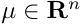
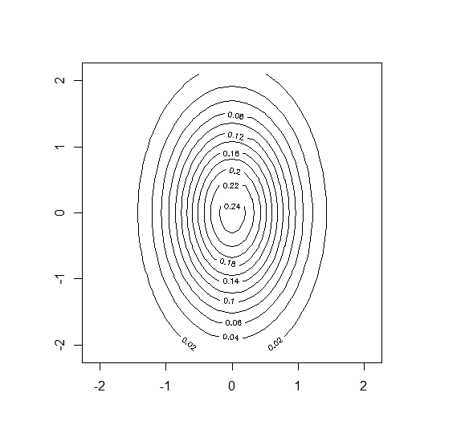
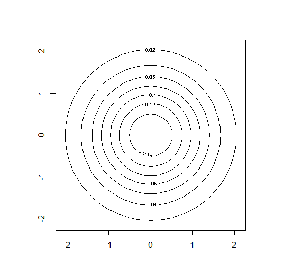
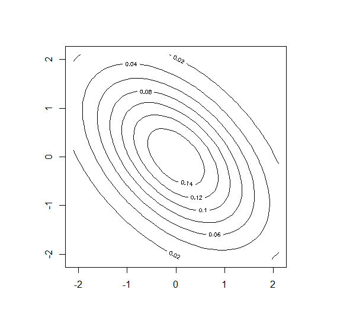

# СМПР
## Метрические алгоритмы
1. ### [Метод kNN и kwNN](/metricAlgo)

## Байесовские алгоритмы
1. ### [Линии уровня](/bayesAlgo/) (**[shiny](https://enverwalker.shinyapps.io/normallines/)**)
1. ### [Наивный байесовский классификатор](/bayesAlgo/) (**[shiny](https://enverwalker.shinyapps.io/naivebayes/)**)
1. ### [Подстановочный (plug-in) алгоритм](/bayesAlgo/) (**[shiny](https://enverwalker.shinyapps.io/plug-in/)**)

## Линейные алгоритмы
1. ### [ADALINE и правило Хебба](/linearAlgo/) (**[shiny](https://enverwalker.shinyapps.io/adalinehebb/)**)

## Байесовские алгоритмы
Введём понятия **вероятностей**:

**Априорная вероятность** – это вероятность, присвоенная событию при отсутствии знания, поддерживающего его наступление.  

**Апостериорная вероятность** – это условная вероятность события при некотором условии, рассматриваемая в противоположность его априорной вероятности.  

**Теорема Байеса:**  
  
**p(y|x)** - _апостериорная вероятности_(вероятность того, что объект x принадлежит классу y)  
**p(x|y)** - _функция правдободобия_  
**p(y)** - _априорная вероятность_ (вероятность появления класса)  

Любой **Байесовский классификатор** основан на принципе максимума _апостериорной вероятности_.  
Если плотности распределения каждого из классов известны, то искомый алгоритм можно выписать в явном виде(он является оптимальным).  
На практике плотности распределения классов обычно не известны. Их приходится (восстанавливать) по обучающей выборке.  

Для классифицируемого объекта вычисляются _функции правдоподобия_ каждого из классов, по ним вычисляются _апостериорные вероятности_ классов. Объект относится к тому классу, для которого _апостериорная вероятность_ максимальна.  

 

Алгоритм **a(x)** называется **оптимальным байесовским решающим правилом**, где   
**P(y)** - _априорные вероятности_ классов,   
**p(x|y)** - _функции правдоподобия_,  
 - _величина потери_ алгоритмом **а** при неправильной классификации объекта класса **y**  

_иными словами_:   
По известному вектору признаков - **x**, мы определяем класс **y**, к которому принадлежит объект из **a(x)** по формуле:   
**a(x) = argmax P(y|x)**, для которого при условии **x**, вероятность класса **y** - наиболее высока.  
## Линии уровня нормального распределения
## Вероятностное распределение с плотностью

называется n-мерным многомерным нормальном распределением\
с математическим ожиданием (центром) ,\
и ковариационной матрицей .\
Предполагается, что матрица симметричная, невырожденная, положительно определенная.

## Геометрия нормальной плотности
1. Если признаки некоррелированны, то матрица ковариации имеет диагональный вид, а линия плотности имеет форму эллипсоида
1. Если признаки имеют одинаковую дисперсию, то эллипсоиды являются сферами
1. Если признаки коррелированы, то матрица не диагональна, а линии уровня имеют форму эллипсоида, оси которого повернуты относительно системы координат

 Некоррелированы | Одинаковая дисперсия | Коррелированы
:-: | :-: | :-:
 |  | 

## Реализация на R
```r
drawLines <- function(center, cv) {
  det <- det(cv)
  a <- cv[2, 2] / det
  b <- -cv[1, 2] / det
  c <- -cv[2, 1] / det
  d <- cv[1, 1] / det
  
  x0 <- center[1]
  y0 <- center[2]
  
  A <- d
  B <- a
  C <- -c -b
  D <- -2*d*x0 + y0*(c+b)
  E <- -2*a*y0 + x0*(c+b)
  F <- d*x0^2 + a*y0^2 + x0*y0*(-c-b)
  
  func <- function(x, y) {
    1 / (2*pi*sqrt(det)) * exp(-0.5 * (x^2*A + y^2*B + x*y*C + x*D + y*E + F))
  }
  
  X <- seq(-2-0.1, 2+0.1, 0.1)
  Y <- seq(-2-0.1, 2+0.1, 0.1)
  Z <- outer(X, Y, func)
  
  contour(X, Y, Z)
}
```
С реализацией на **shiny** можно ознакомиться по
    [ссылке](https://enverwalker.shinyapps.io/normallines/)
### Наивный байесовский классификатор  
**Наивный байесовский алгоритм** – это алгоритм классификации, основанный на _теореме Байеса_ с предположением, что все признаки есть независимые случайные величины. **НБА** предполагает, что наличие какого-либо признака в классе не связано с наличием какого-либо другого признака. В его работе стоит задача найти оценки **n**-одномерных плотностей(**j-го** признака для класса **y**.) и подставить их в оптимальное байесовское решающее правило.

Ниже представлен код программы **Наивного нормального байесовского классификатора:**
```R
naiveb = function(x, Py, Mo, covar, m, n) {
  kolvo <- matrix(c('setosa','versicolor', 'virginica', 0, 0, 0), nrow = 3, ncol = 2)
  schet = rep(0, m)
  for (i in 1:m) {
    schet[i] = Py[i]
    for (j in 1:n){
      N=1/sqrt(2*pi)/covar[i,j]*exp(-1/2*(x[j]-Mo[i,j])^2/covar[i,j]^2) #вычисление плотностей
      schet[i] = schet[i] * N #ищем для каждого класса
    }
    kolvo[i,2]=schet[i]
  }
  class <- kolvo[,1][which.max(kolvo[,2])]
}
```
#### Карта классификации:
  
С реализацией на **shiny** можно ознакомиться по
    [ссылке](https://enverwalker.shinyapps.io/naivebayes/)

### Подстановочный алгоритм  
Он же __Plug-in__, является _байесовским_ алгоритмом классификации, в котором для восстановления плотностей используется модель _многомерного нормального распределения_:  
,  
где  - это мат. ожидание(центр),  
а  - ков. матрица (симметричная, невырожденная, положительно определённая).  
В основе метода лежит восстановление параметров для каждого класса по следующим формулам:  
,  
.  
Далее они подставляются в формулу _оптимального байесовского классификатора_.  
Предполагается, что ковариационные матрицы не равны.  

__Пример работы Plug-in__  
(250 объектов в каждом классе)  
Ковариационные матрицы и мат. ожидания:  
```R
Sigma1 <- matrix(c(10, 0, 0, 1), 2, 2)
Sigma2 <- matrix(c(1, 0, 0, 5), 2, 2)
Mu1 <- c(1, 0)
Mu2 <- c(15, 0)
```  
  
С реализацией на **shiny** можно ознакомиться по
    [ссылке](https://enverwalker.shinyapps.io/plug-in/) 
